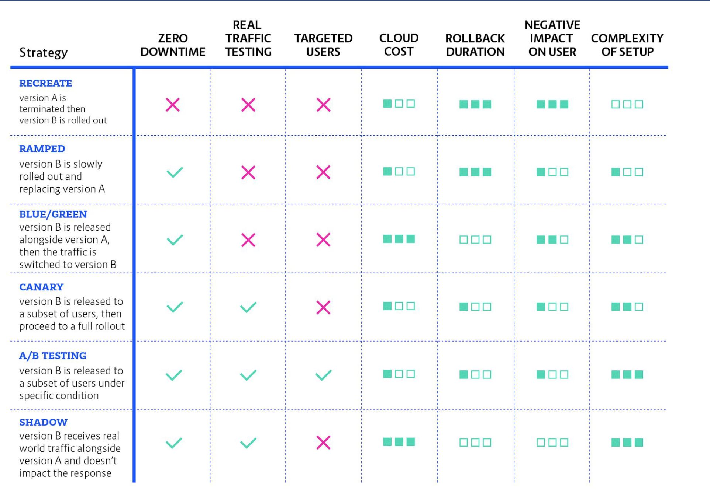

Kubernetes enables services using docker's containerization of server resouces: computing and storage, in a "Pod" conception, to isolate service and its resources.<br />

Ingress layer is a layer that services wrapped, there are some controllers：
- Nginx
- HA Proxy
- Traefik
- Istio
- Linkerd
- GKE

Using this Ingress layer, we can apply different deployment strategies:
- Recreate: easy setup but with service downtime
``` kind: Deployment
spec:
    replicas: 3 
    strategy:
        type: Recreate
```
- Ramped - aka Incremental, Rolling, easy setup but rollout/rollback can take time
``` kind: Deployment
spec:
    replicas: 3 
    strategy:
        type: RollingUpdate
        rollingUpdate:
          maxSurge: 2
          maxUnavailable: 0
```
- Blue/Green: instant rollout/rollback, but require double resource
```
$ kubectl apply -f ./manifest-v2.yaml
$ kubectl patch service my-app -p \
    '{"spec":{"selector":{"version":"v2.0.0"}}}'
$ kubectl delete -f ./manifest-v1.yaml

```
- Canary: 
```
# v1
kind: Deployment
metadata:
  name: my-app-v1
spec:
  replicas: 9 
  template:
    labels:
      app: my-app
      version: v1.0.0
# app
kind: Service
metadata:
  name: my-app
spec:
  selector:
    app: my-app

# v2
kind: Deployment
metadata:
  name: my-app-v2
spec:
  replicas: 1 
  template:
    labels:
      app: my-app
      version: v2.0.0
```
```
$ kubectl apply -f ./manifest-v2.yaml
$ kubectl scale deploy/my-app-v2 --replicas=10
$ kubectl delete -f ./manifest-v1.yaml
```

Summary:



